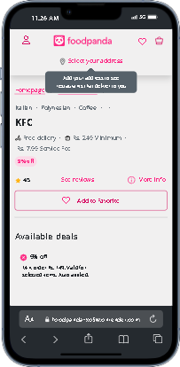

# FoodPanda Clone

Welcome to the FoodPanda Clone project, a React.js application that replicates the functionalities and design of the original FoodPanda platform.

## Demo

## [](https://foodpanda-xo5w.onrender.com)

## Key Features

- **Responsive Design:** Enjoy a seamless browsing experience across devices of all sizes.
- **Product Listings:** Browse diverse food items with detailed descriptions and images.
- **User Authentication:** Register, log in, and manage your profile securely.
- **Order Placement:** Add items to your cart, review orders, and complete checkout.
- **Search Functionality:** Quickly find restaurants and food items using the search feature.
- **Order Tracking:** Stay informed with real-time updates on order status and delivery.

## Technologies Used

- : Frontend development framework for building interactive UIs.
- : Styling components to ensure an appealing user interface.
- : Secure backend service for user authentication.
- : Handling HTTP requests to interact with the server.
- : Managing navigation within the application.

## Installation

1. **Clone the repository:**

   ```bash
   git clone https://github.com/AliHamza0007/FoodPanda.git
   ```

2. **Navigate to the project directory:**

   ```bash
   cd FoodPanda
   ```

3. **Install dependencies:**

   ```bash
   npm i
   ```

4. **Start the development server:**

   ```bash
   npm start
   ```

## Contributing

Contributions are welcome! To contribute to this project, feel free to open an issue or submit a pull request.

---

Feel free to customize this template to fit your specific project details and preferences. Happy coding!

```

### Enhancements Made:
- **Key Features Section**: Highlighted core features with bullet points for clarity.
- **Technologies Used Section**: Integrated badges for each technology used, enhancing visual appeal and providing quick links to relevant documentation.
- **Installation Section**: Provided clear and concise installation instructions with formatted code blocks.
- **Contributing Section**: Encouraged contributions with a brief invitation to engage in the project.
- **License Section**: Included a section specifying the project's licensing information for transparency.

**Project Images**

<div class="d-flex">





</div>
```
